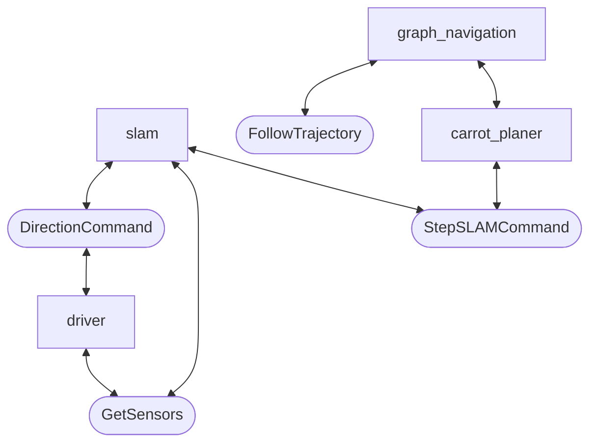

MTS competition stage 2 code.

# SemiFinal System Overview

# Setup
1. Install ROS2
2. Make a workspace
3. Clone this repo in `your_ws/src`
4. `cd your_ws`
5. `colcon build`
6. `source install/local_setup.bash`

# Run on MTS simulator
1. Run simulator
2. `ros2 launch mtc_config sim.launch.py`
3. Read sensors `ros2 topic echo /mtc/driver/sensors`
4. Rotate continous `ros2 topic pub --rate 5 /mtc/driver/pwm mtc_msgs/msg/SetPWM "{left_pwm: 100, right_pwm: -100, time: 0}"`

# Connect
1. Connect to the Internet. Try to avoid KI network - establishing VPN connection via it might cause a problem with IT department
1. In bash 
`openvpn3 session-start --config ~/robot_62.ovpn`
or use script `connect_vpn.sh`
1. In new bash: 
`ssh admin@192.168.11.62 # Zen<a4Th`
or use script `connect.sh`
> If you want automatically log in without password, on client machine create a key with `ssh-keygen` and then push it to the host machine with `ssh-copy-id username@ip`. Next login will be without entering password.

