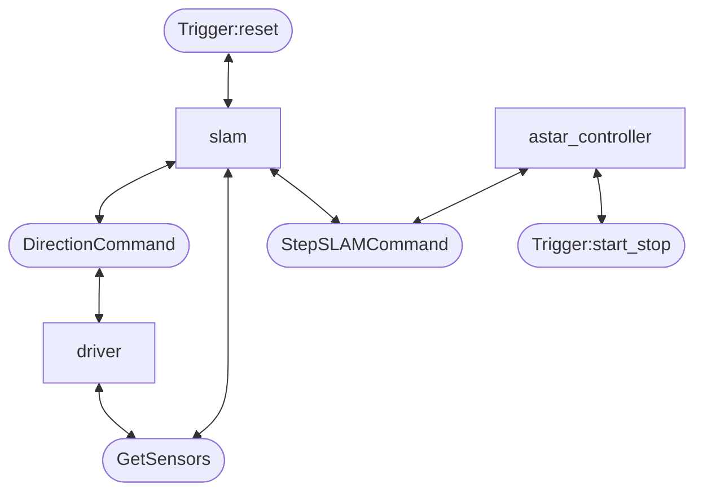

MTS competition stage 2 code.

# SemiFinal System Overview

# Setup
1. Install ROS2
2. Make a workspace
3. Clone this repo in `your_ws/src`
4. `cd your_ws`
5. `colcon build`
6. `source install/local_setup.bash`

# Run on MTS simulator
1. Run simulator (62)
2. `ros2 launch mtc_config sim.launch.py`
3. `ros2 service call /mtc/astar_controller/start_pause std_srvs/srv/Trigger {}`

# Run real bot
1. Connect and stuff
2. `ros2 launch mtc_config real.launch.py`
3. `ros2 service call /mtc/astar_controller/start_pause std_srvs/srv/Trigger {}`

# Run bag replay
1. `ros2 launch mtc_config bag.launch.py`
2. `cd mtc_config/bag_files`
3. Choose file to play `ros2 bag play rosbag2_2024_10_...`

## Bugs to videos:
`rosbag2_2024_10_27-08_19_03` - `trial4_3.mp4`

# Run dummy robot control
1. cd to mtc_drivers/mtc_drivers
1. run program with all params `python3 dummy-robot.py -r id1 -i 192.168.11.11 -a 90 -d 180 -s 1.5`  
1. to get list of params `python3 dummy-robot.py --help`

# Connect
0. Install [openvpn3](https://openvpn.net/cloud-docs/tutorials/configuration-tutorials/connectors/operating-systems/linux/tutorial--learn-to-install-and-control-the-openvpn-3-client.html)
1. Connect to the Internet. Try to avoid KI network - establishing VPN connection via it might cause a problem with IT department
1. In bash 
`openvpn3 session-start --config ~/robot_62.ovpn`
or use script `connect_vpn.sh`
1. In new bash: 
`ssh admin@192.168.11.62 # Zen<a4Th`
or use script `connect.sh`
> If you want automatically log in without password, on client machine create a key with `ssh-keygen` and then push it to the host machine with `ssh-copy-id username@ip`. Next login will be without entering password.

## Disconnect
1. `openvpn3 sessions-list`
2. `openvpn3 session-manage --path <PATH FROM> --disconnect`

# Bags
## Zip Bags
Create zip archive bags.zip with everthing from folder _bags/_

`zip -r bags.zip bags/ `

Program _zip_ required:
`sudo apt install zip`

## Download file from remote machine
Copy file from remote machine to current machine. Whole path to remote file is required. 

`scp admin@192.168.11.62:/home/admin/bags.zip .  `

